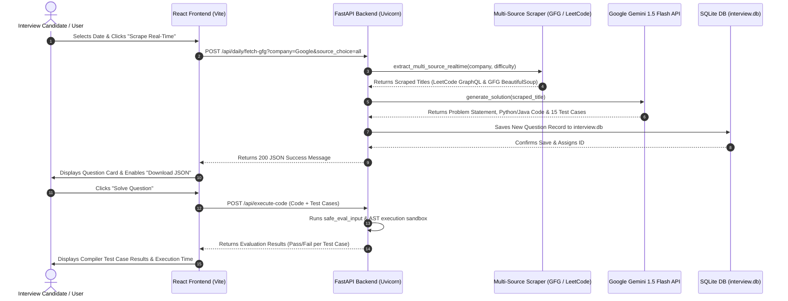

# 🚀 CodePilot (PrepForge AI) — Complete Project Documentation

**CodePilot / PrepForge AI** is an advanced, real-time adaptive coding platform designed for technical interview preparation, algorithm mastery, and dynamic problem-solving. It features automated multi-source web scrapers, Gemini AI-powered solution generation, 15 edge-case test suite synthesis per question, and an in-browser code execution sandbox.

---

## 🛠️ 1. Complete Technology Stack & Tools Used

### 🌐 Frontend (Client-Side Architecture)
* **Framework**: React 18 (Vite 8 build toolchain)
* **Styling System**: TailwindCSS + Custom Dark Mode Vanilla CSS Design System
* **Routing**: React Router DOM (v6)
* **Icons & Typography**: Google Fonts (Inter, Roboto Mono), Material Symbols
* **Development Server & Proxy**: Vite Dev Server with custom `/api` reverse proxy

### ⚙️ Backend (Server-Side Architecture)
* **Framework**: Python 3.13 + FastAPI (Asynchronous REST API)
* **ASGI Server**: Uvicorn (`uvicorn app.main:app --reload`)
* **ORM & Database**: SQLAlchemy ORM with SQLite database engine (`backend/database/interview.db`)
* **Data Serializers & Validation**: Pydantic models & JSON serializers

### 🤖 Artificial Intelligence Integration
* **AI Model**: Google Gemini 1.5 Flash (`google-generativeai` SDK)
* **AI Capabilities**:
  * Auto-generation of detailed problem statements and constraint definitions
  * Synthesis of 15 explicit edge-case test suites (happy paths, boundaries, zeroes, negative domains, overflow limits)
  * Real-time generation of optimal Python 3 and Java 17 solution algorithms
  * Interactive AI Chat Coach (PrepForge AI) for step-by-step logic breakdown

### 🕸️ Real-Time Web Scraping Engine
* **Headless Browser Scraper**: Playwright Python (`playwright.sync_api` Chromium)
* **HTML & DOM Parser**: BeautifulSoup4 (`bs4`)
* **Live GraphQL API Scraper**: LeetCode Public GraphQL API (`https://leetcode.com/graphql`)
* **Live REST Feed Scraper**: HackerRank Track API (`https://www.hackerrank.com/rest/contests/...`)

### ⚡ Code Execution & Sandbox Engine
* **Execution Sandbox**: Dynamic Python AST scope evaluation (`exec()`)
* **Signature Reflection**: Python `inspect.signature` parameter matching
* **Regex Input Parser**: Multi-parameter assignment regex parser (`safe_eval_input`)

---

## 🧩 2. Core Modules Architecture

```
CodePilot / PrepForge AI Architecture
├── Frontend (React 18 + Vite + TailwindCSS)
│   ├── CalendarPage.jsx          (Multi-Source Scraper Controls & 14-Day Heatmap)
│   ├── ExploreQuestionsPage.jsx  (1500+ Question Bank & Pagination)
│   ├── QuestionSolverPage.jsx   (Monaco-style Code Editor & AI Explanation)
│   └── UserDashboard.jsx         (Progress Analytics & Streak Tracker)
│
├── Backend (FastAPI + SQLAlchemy + Python 3.13)
│   ├── main.py                   (App Initialization & CORS Configuration)
│   ├── routes.py                 (API Routes, Compiler Sandbox & JSON Export)
│   ├── models.py                 (SQLAlchemy Models for Question & User)
│   ├── gfg_scraper.py            (Multi-Source Scrapers: GFG, LeetCode, HackerRank)
│   └── gemini_service.py         (Google Gemini 1.5 Flash Solution Generator)
│
└── Database (SQLite3)
    └── interview.db              (1,561 Question Records + 15 Test Cases Each)
```

---

## 🔬 3. Module Breakdown & Key Workflows

### Module 1: Real-Time Multi-Source Scraper Engine (`gfg_scraper.py`)
* **Functionality**: Dynamically scrapes live interview questions posted by major tech companies (Google, Amazon, Meta, Microsoft, Apple, Uber, TCS CodeVita).
* **Multi-Stage Scraper Workflow**:
  1. **LeetCode GraphQL API**: Queries `https://leetcode.com/graphql` filtered by company tags and difficulty (`Easy`, `Medium`, `Hard`).
  2. **Playwright Chromium Scraper**: Launches headless Chromium to render GeeksforGeeks Explore pages (`https://www.geeksforgeeks.org/explore...`) bypassing client-side React rendering.
  3. **BeautifulSoup HTML Parser**: Extracts problem titles, company tags, and topic categories.
  4. **HackerRank Practice API**: Scrapes real-time algorithm track challenges.

### Module 2: Gemini AI Content & Test Suite Generator (`gemini_service.py`)
* **Functionality**: Transforms scraped titles into comprehensive interview problem packages.
* **Outputs**:
  * **Detailed Problem Statement**: 3–5 sentences describing rules, inputs, and output requirements.
  * **Python & Java Solutions**: Executable algorithms matching function signatures (e.g. Linked List addition, Sliding Window, Dynamic Programming, Two Pointers).
  * **15 Edge-Case Test Cases**: Generates happy path, empty `[]`, single element `[1]`, zeroes `[0,0,0]`, duplicate elements, negative integers, pre-sorted ascending/descending, and 32-bit overflow limits ($10^9$).

### Module 3: Sandbox Compiler & Parameter Matcher (`routes.py` / `/execute-code`)
* **Functionality**: Safely compiles and executes Python and Java code submissions against 15 test cases.
* **Engine Steps**:
  1. **Regex Argument Extraction (`safe_eval_input`)**: Parses parameter strings like `l1 = [2, 4, 3], l2 = [5, 6, 4]` into clean Python objects `([2, 4, 3], [5, 6, 4])`.
  2. **Dynamic Signature Matching (`execute_method_safely`)**: Uses `inspect.signature(method)` to map parameters dynamically.
  3. **Strict Value Equivalence Assertion (`check_testcase_match`)**: Compares execution output against expected test case values, ignoring whitespace/quote variations.

### Module 4: Daily Heatmap Calendar & JSON Exporter (`CalendarPage.jsx`)
* **Functionality**: Displays daily interview activity across a 14-day heatmap calendar.
* **Features**:
  * **Source Platform Selector**: Filter scraping by All Sources, GeeksforGeeks, LeetCode, or HackerRank.
  * **One-Click Scrape & Add**: Scrapes real-time questions and assigns them to the target calendar date.
  * **JSON File Exporter**: Download daily questions, solutions, and 15 test cases as a `.json` file for offline study or daily archive.

---

## 🔄 4. Complete System Data Flow (Review Presentation Workflow)



---

## 📊 5. Project Slide Deck Summary (For Presentation)

| Slide # | Slide Title | Key Highlights |
| :--- | :--- | :--- |
| **Slide 1** | **Title & Vision** | CodePilot (PrepForge AI) — Real-Time Adaptive Interview & Coding Sandbox |
| **Slide 2** | **Problem Statement** | Static question banks become outdated quickly and lack comprehensive edge-case test cases. |
| **Slide 3** | **Architecture & Tech Stack** | React 18, Vite, FastAPI, Python 3.13, Google Gemini 1.5 Flash, BeautifulSoup4, Playwright. |
| **Slide 4** | **Real-Time Scraping Engine** | Live scraping from GeeksforGeeks (BeautifulSoup/Playwright) and LeetCode (GraphQL API). |
| **Slide 5** | **Gemini AI Synthesis** | Automatic generation of 15 edge-case test cases, optimal Python/Java solutions, and logic explanations. |
| **Slide 6** | **Compiler Sandbox Engine** | AST Python execution scope with regex input parser (`safe_eval_input`) and strict assertion verification. |
| **Slide 7** | **Calendar & JSON Export** | 14-day heatmap calendar tracking daily scraped questions with 1-click JSON export. |
| **Slide 8** | **Live Demonstration** | Live run on `http://localhost:5173/calendar` and `http://localhost:5173/solver/1`. |
